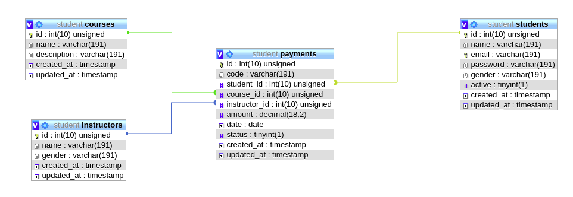

# Student

Sample Project of student enrollment

## Instalation
1. Run `composer install`.
2. Run `php artisan migrate` to initiate data.
3. Run `yarn`.
4. Run `yarn dev` to compile front-end.
5. Access web from port `8000`.

## DB Schema

